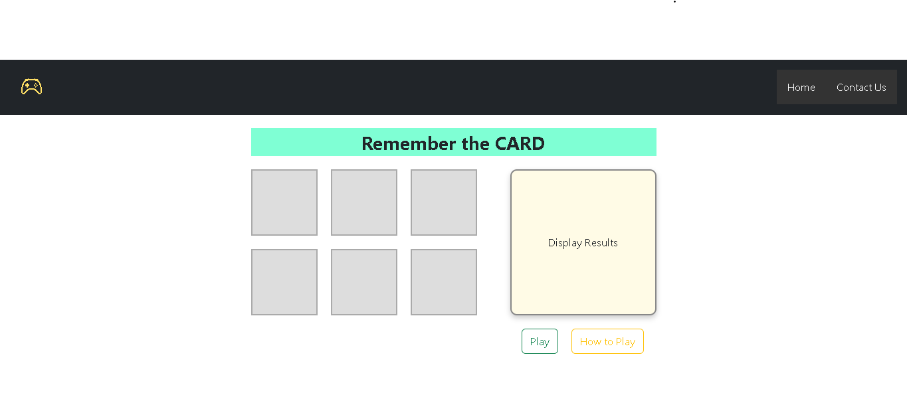
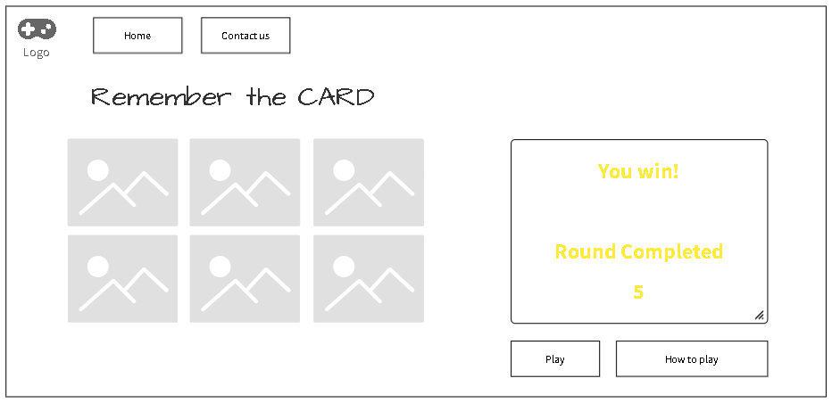

# 🧠 Remember the CARD

## 🎯 Description

**Remember the CARD** is a memory-based browser game built with **HTML, CSS, and JavaScript**.  
When the player clicks the **Play** button, two random cards are briefly highlighted.  
The player must then select those two cards from memory.

- If both selections are correct: 🎉 **You win!**
- If either is incorrect: ❌ **You lose!**
- The round counter increases on success and resets on failure.

The game encourages focus, memory skill, and fast recall!

---

## 🚀 Getting Started

### ▶️ Live Demo

👉 [Play the game](https://your-github-username.github.io/remember-the-card/) *(Replace with your actual link)*

### 🧾 How to Play

1. Click the **Play** button to begin.
2. Two cards will be briefly highlighted.
3. Memorize their positions.
4. Select the cards you believe were highlighted.
5. Get both right to win the round, or lose and restart!

---

## 🛠️ Technologies Used

- HTML5
- CSS3 (with some Bootstrap 5)
- JavaScript (DOM Manipulation, Events)

---

## 🖌️ Features

- Visual card highlights
- Round tracking system
- Win/Lose result feedback
- "How to Play" modal for user instructions
- Responsive layout using Bootstrap

---

## 🧠 Future Work

- Add a countdown timer for card memorization
- Add sound effects for correct/incorrect guesses
- Add difficulty levels (more cards, faster timing)
- Mobile responsiveness polishing

---

## 🖼️ Wireframe

---

## 📞 Contact

Feel free to reach out for collaboration or feedback!

- Name: Hesham Ahmed
- GitHub: [@hesham243](https://github.com/hesham243)
- Email: heshamahmed243@gmail.com

---

🧩 Built with 💙 by Hesham Ahmed  
